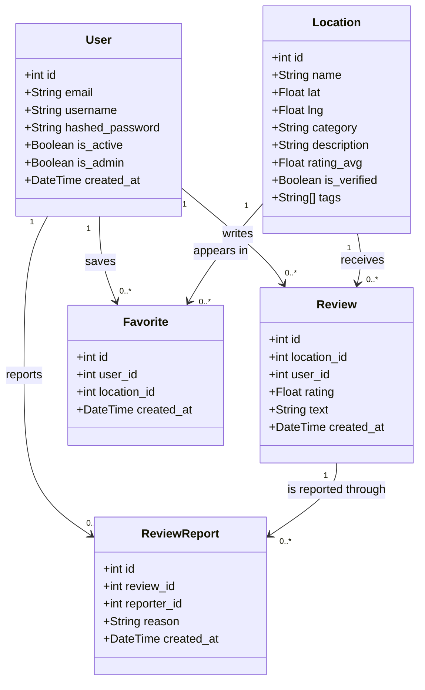
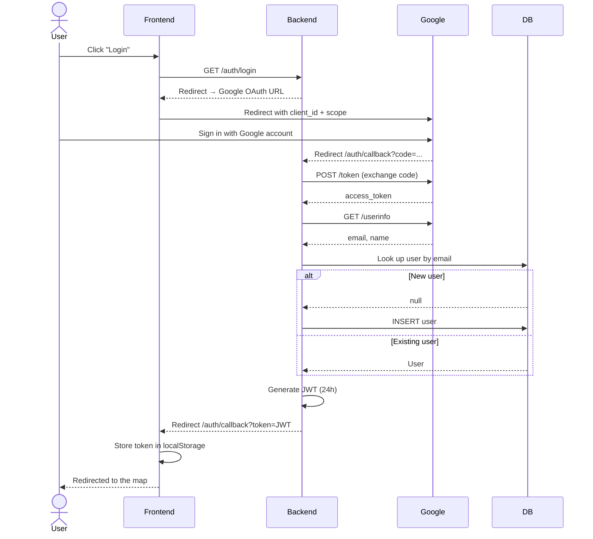
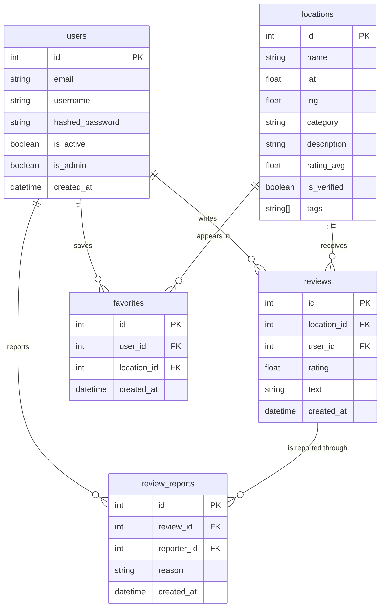

# Brașov Interactive Map

An interactive web application for exploring the city of Brașov — locations, reviews, favorites and a local AI guide.

## Tech Stack

**Frontend:** React 19, TypeScript, Vite, React-Leaflet  
**Backend:** FastAPI, SQLAlchemy, PostgreSQL, Alembic  
**AI:** Groq API (Llama 3.1)  
**Auth:** Google OAuth 2.0 + JWT

## Features

- **Interactive map** with locations in Brașov (cafés, parks, restaurants, tourist attractions, etc.)
- **Filtering and search** by name, category or tags
- **Reviews** — add, view and delete reviews with ratings
- **Review reporting** — report inappropriate content; admins can manage reports
- **Favorites** — save your favorite locations and view them on your profile
- **Review history** — see all the reviews you have written
- **Local AI guide** — conversational assistant that recommends locations, routes, and can add new locations from a Google Maps link (admins only)
- **Admin panel** — manage locations, approve, delete and moderate reports
- **Google sign-in** — log in with a Google account

## Documentation

- [AI Documentation](docs/AI_DOCUMENTATION.md) — architecture and inner workings of the local AI guide (Groq / Llama 3.1)
- [AI Agents Evaluation](docs/AGENTS_EVALUATION.md) — how AI agents (Claude Code) were used and evaluated during the development of this project

## Running locally

### Requirements
- Docker Desktop
- Node.js 18+
- Python 3.11+

### 1. Database
```bash
docker compose up -d
```

### 2. Backend
```bash
cd backend
python -m venv venv
.\venv\Scripts\Activate.ps1   # Windows
pip install -r requirements.txt
alembic upgrade head
uvicorn app.main:app --reload
```

Backend available at `http://localhost:8000`  
API documentation: `http://localhost:8000/docs`

### 3. Frontend
```bash
cd frontend
npm install
npm run dev
```

Frontend available at `http://localhost:5173`

### 4. Environment variables

Create the `backend/.env` file:

```env
GOOGLE_CLIENT_ID=...
GOOGLE_CLIENT_SECRET=...
GOOGLE_REDIRECT_URI=http://localhost:8000/auth/callback
SECRET_KEY=...
GROQ_API_KEY=...
ALLOWED_DOMAINS=gmail.com,s.unibuc.ro,unibuc.ro
# optional — comma-separated list of allowed CORS origins
# (default: http://localhost:5173,http://localhost)
CORS_ORIGINS=http://localhost:5173,http://localhost
# optional — frontend URL used for the post-login redirect
# (default: http://localhost:5173)
FRONTEND_URL=http://localhost:5173
```

The frontend optionally reads `VITE_API_URL` (default `http://localhost:8000`) — the backend URL, embedded into the bundle at build time.

## UML Diagrams

### Class Diagram — Models



### Sequence Diagram — Google OAuth Authentication



### ER Diagram — Database



## CI/CD

- **CI** (`.github/workflows/ci.yml`) — on every push/PR to `develop`/`main`: backend tests (pytest + PostgreSQL), frontend lint and build
- **CD** (`.github/workflows/cd.yml`) — after every successful CI run on `develop`/`main`: builds the Docker images for the backend and frontend and publishes them to GitHub Container Registry

The published images can be run directly:

```bash
docker pull ghcr.io/lucaserban1/harta-interactiva-brasov-backend:latest
docker pull ghcr.io/lucaserban1/harta-interactiva-brasov-frontend:latest
```

For a different environment, build the frontend image with the desired backend URL:

```bash
docker build --build-arg VITE_API_URL=https://api.example.com -t frontend ./frontend
```

## Project structure

```
├── backend/
│   ├── app/
│   │   ├── models/        # SQLAlchemy models
│   │   ├── schemas/       # Pydantic schemas
│   │   ├── crud/          # Data access logic
│   │   ├── routers/       # FastAPI endpoints
│   │   └── main.py
│   ├── alembic/           # Database migrations
│   └── requirements.txt
├── frontend/
│   └── src/
│       ├── components/    # MapView, LocationPanel, AIAssistant etc.
│       ├── pages/         # ProfilePage, AdminPage, AuthCallback
│       └── api.ts
└── docker-compose.yml
```
