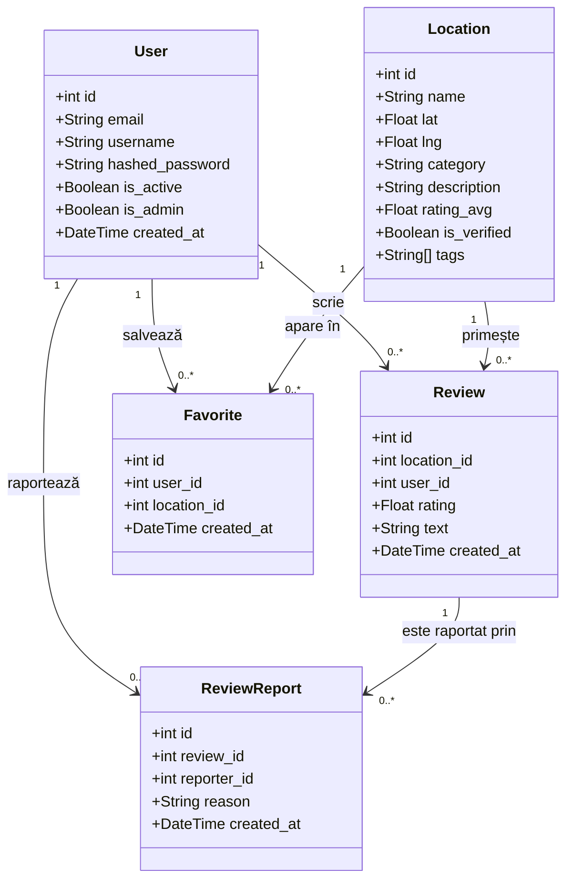
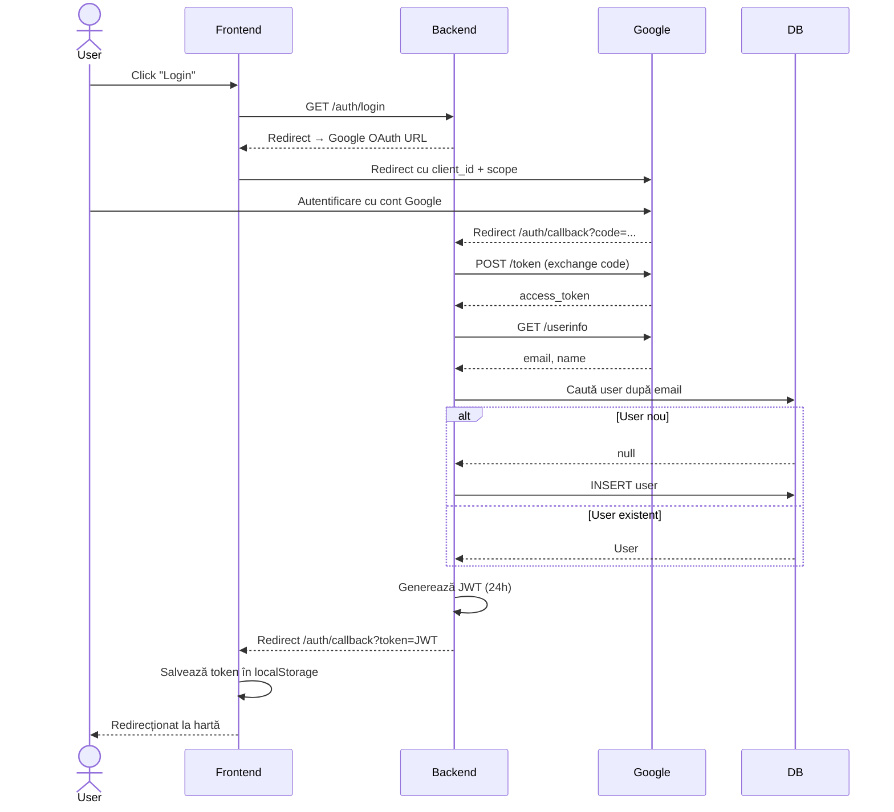
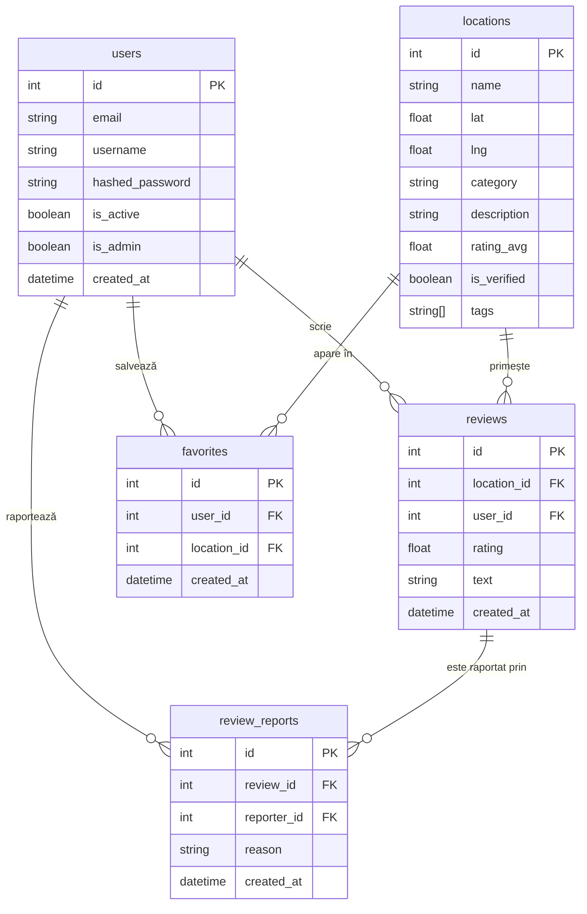

# Harta Interactivă Brașov

O aplicație web interactivă pentru explorarea orașului Brașov — locații, recenzii, favorite și un ghid AI local.

## Tehnologii

**Frontend:** React 19, TypeScript, Vite, React-Leaflet  
**Backend:** FastAPI, SQLAlchemy, PostgreSQL, Alembic  
**AI:** Groq API (Llama 3.1)  
**Auth:** Google OAuth 2.0 + JWT

## Funcționalități

- **Hartă interactivă** cu locații din Brașov (cafenele, parcuri, restaurante, obiective turistice etc.)
- **Filtrare și căutare** după nume, categorie sau taguri
- **Recenzii** — adaugă, vizualizează și șterge recenzii cu rating
- **Raportare recenzii** — raportează conținut nepotrivit; adminii pot gestiona rapoartele
- **Favorite** — salvează locații preferate și le vizualizezi în profilul tău
- **Istoric recenzii** — vezi toate recenziile scrise de tine
- **Ghid AI local** — asistent conversațional care recomandă locații, trasee și poate adăuga locații noi prin link Google Maps (doar admini)
- **Admin Panel** — gestionează locații, aprobă, șterge și moderează rapoarte
- **Autentificare Google** — login cu cont Google

## Documentație

- [Documentația AI](docs/AI_DOCUMENTATION.md) — arhitectura și funcționarea Ghidului AI local (Groq / Llama 3.1)
- [Evaluarea agenților AI](docs/AGENTS_EVALUATION.md) — cum au fost folosiți și evaluați agenții AI (Claude Code) în dezvoltarea proiectului

## Rulare locală

### Cerințe
- Docker Desktop
- Node.js 18+
- Python 3.11+

### 1. Baza de date
```bash
docker compose up -d
```

### 2. Backend
```bash
cd backend
python -m venv venv
.\venv\Scripts\Activate.ps1   # Windows
pip install -r requirements.txt
alembic upgrade head
uvicorn app.main:app --reload
```

Backend disponibil la `http://localhost:8000`  
Documentație API: `http://localhost:8000/docs`

### 3. Frontend
```bash
cd frontend
npm install
npm run dev
```

Frontend disponibil la `http://localhost:5173`

### 4. Variabile de mediu

Creează fișierul `backend/.env`:

```env
GOOGLE_CLIENT_ID=...
GOOGLE_CLIENT_SECRET=...
GOOGLE_REDIRECT_URI=http://localhost:8000/auth/callback
SECRET_KEY=...
GROQ_API_KEY=...
ALLOWED_DOMAINS=gmail.com,s.unibuc.ro,unibuc.ro
# opțional — origin-urile permise de CORS, separate prin virgulă
# (default: http://localhost:5173,http://localhost)
CORS_ORIGINS=http://localhost:5173,http://localhost
```

Frontend-ul citește opțional `VITE_API_URL` (default `http://localhost:8000`) — URL-ul backend-ului, embedat în bundle la build.

## Diagrame UML

### Class Diagram — Modele



### Sequence Diagram — Autentificare Google OAuth



### ER Diagram — Baza de date



## CI/CD

- **CI** (`.github/workflows/ci.yml`) — la fiecare push/PR pe `develop`/`main`: teste backend (pytest + PostgreSQL), lint și build frontend
- **CD** (`.github/workflows/cd.yml`) — la fiecare push pe `develop`/`main`: construiește imaginile Docker pentru backend și frontend și le publică pe GitHub Container Registry

Imaginile publicate pot fi rulate direct:

```bash
docker pull ghcr.io/lucaserban1/harta-interactiva-brasov-backend:latest
docker pull ghcr.io/lucaserban1/harta-interactiva-brasov-frontend:latest
```

Pentru un alt mediu, imaginea de frontend se construiește cu URL-ul backend-ului dorit:

```bash
docker build --build-arg VITE_API_URL=https://api.example.com -t frontend ./frontend
```

## Structura proiectului

```
├── backend/
│   ├── app/
│   │   ├── models/        # Modele SQLAlchemy
│   │   ├── schemas/       # Scheme Pydantic
│   │   ├── crud/          # Logică acces date
│   │   ├── routers/       # Endpoint-uri FastAPI
│   │   └── main.py
│   ├── alembic/           # Migrații bază de date
│   └── requirements.txt
├── frontend/
│   └── src/
│       ├── components/    # MapView, LocationPanel, AIAssistant etc.
│       ├── pages/         # ProfilePage, AdminPage, AuthCallback
│       └── api.ts
└── docker-compose.yml
```
